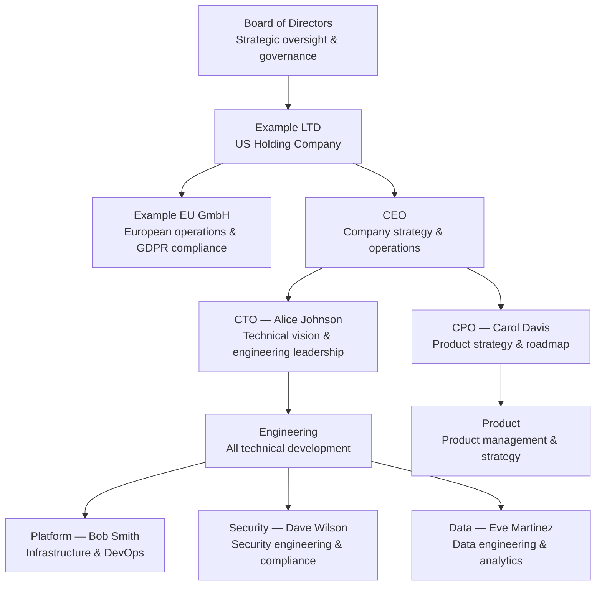

# Example LTD - Decision Documentation

This is the central decision documentation repository for Example LTD, housing all architectural decisions (ADRs), policies, opportunities, and incident reports.

## Vision

Build the most trusted and developer-friendly software platform in the industry, enabling teams to ship secure, scalable products with confidence.

## Mission

Empower engineering teams through transparent decision-making, robust documentation practices, and a culture of continuous improvement — so every decision is traceable, every tradeoff is understood, and every lesson is shared.

## About Example LTD

Example LTD is a technology company operating globally with headquarters in the US and a subsidiary in Europe (Example EU GmbH). We build innovative software solutions with a focus on security, scalability, and user experience.

## Architecture

```d2
direction: right

users: Users {
  shape: person
}

services: Services {
  api: API Gateway {
    shape: cloud
  }
  auth: Auth Service {
    shape: cloud
  }
  data: Data Platform {
    shape: cylinder
  }
}

users -> services.api: HTTPS
services.api -> services.auth: Authenticate
services.api -> services.data: Query/Store
```

## Corporate Structure



## Services

<!-- dg:services:start -->
| Service | Status | Owner | Stack | Description |
|---------|--------|-------|-------|-------------|
| [API Gateway](services/api/README.md) | Live | @bob | TypeScript (+1) |  |
| [Auth Service](services/auth-service/README.md) | Live | @dave | Go (+2) |  |
| [Data Platform](services/data-platform/README.md) | Beta | @eve | Python (+1) |  |
<!-- dg:services:end -->
## Teams

- **Engineering** (@team/engineering) - Led by Alice Johnson, responsible for all technical development
  - **Platform** (@team/platform) - Infrastructure and DevOps (Lead: Bob Smith)
  - **Security** (@team/security) - Security engineering (Lead: Dave Wilson)
  - **Data** (@team/data) - Data engineering and analytics (Lead: Eve Martinez)
- **Product** (@team/product) - Product management and strategy (Lead: Carol Davis)

## Local development

### Prerequisites

- Node.js 20+ and npm/bun
- Go 1.22+ (for auth-service)
- Python 3.12+ (for data-platform)
- Docker and Docker Compose

### Getting started

```bash
# Clone the repository
git clone git@github.com:example-ltd/monorepo.git
cd monorepo

# Install dependencies
bun install

# Start all services locally
docker compose up -d

# Run the API gateway
cd services/api && bun run dev

# Run tests
bun test
```

### Project structure

```
services/
  api/              # API Gateway (TypeScript)
  auth-service/     # Authentication (Go)
  data-platform/    # Data pipeline (Python)
docs/               # Decision documentation (this site)
```

### Contributing

1. Create a feature branch from `main`
2. Make your changes and add tests
3. Submit a pull request with a clear description
4. Ensure all CI checks pass before requesting review

## License

Proprietary - Example LTD. All rights reserved.
