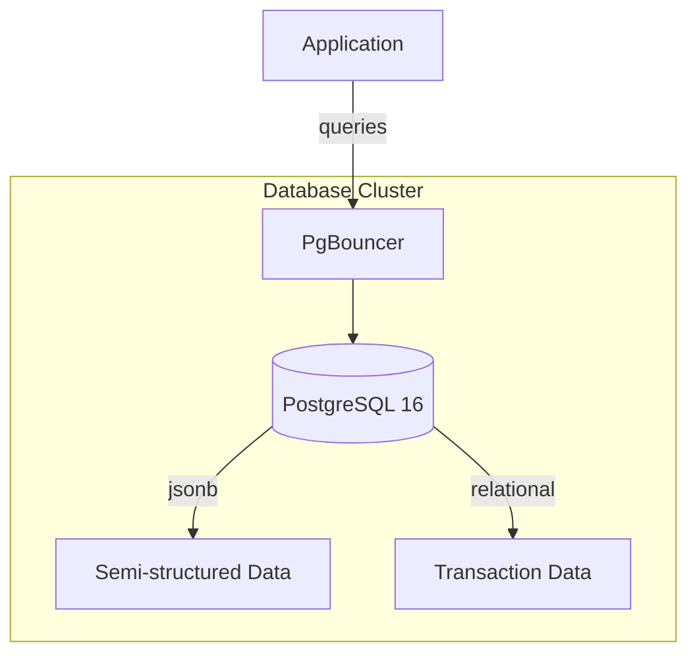

## Context

Our application needs a relational database that supports complex queries, **ACID** transactions, and JSON storage for semi-structured data. We evaluated *PostgreSQL*, *MySQL*, and *CockroachDB*. The team has existing PostgreSQL expertise, and our cloud provider offers managed PostgreSQL with automated backups and failover.

We need strong consistency guarantees for financial transaction data while also supporting flexible schema evolution for user-facing features that change frequently.

## Decision

We will use PostgreSQL 16 as our primary data store. All transactional data flows through PostgreSQL. We use the `jsonb` column type for semi-structured metadata rather than introducing a separate document store.

Connection pooling is handled by PgBouncer in transaction mode, configured with a maximum of 100 connections per application instance. Each microservice gets its own schema within the same database cluster to maintain isolation while enabling cross-service queries when needed.

## Architecture

## Consequences

### Positive

- Team already has deep PostgreSQL experience — no ramp-up time needed.
- Managed PostgreSQL on our cloud provider gives us automated backups, point-in-time recovery, and read replicas with minimal ops burden.
- `jsonb` columns eliminate the need for a separate document store for configuration and metadata.
- Strong ecosystem of tooling: pgAdmin, pg_stat_statements, EXPLAIN ANALYZE for query optimization.

### Negative

- Single-region deployment means we accept higher latency for users in other regions until we address this in a future ADR.
- Connection pooling with PgBouncer adds operational complexity and limits use of prepared statements in transaction mode.
- Vertical scaling has an upper bound — if we outgrow the largest available instance, we will need to shard or migrate to a distributed database.
