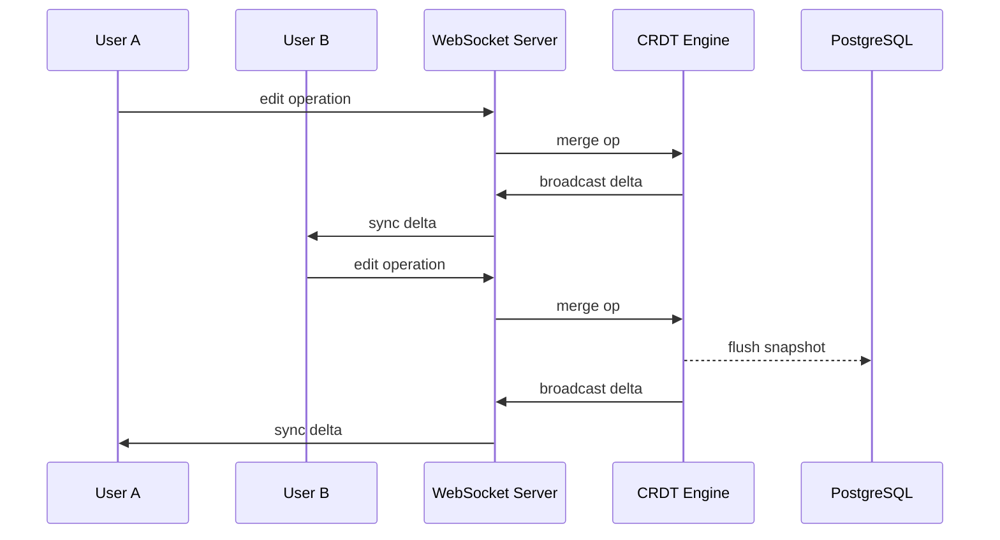

## Description

Users have repeatedly requested the ability to edit documents simultaneously with their teammates. Currently, the application uses optimistic locking — if two users edit the same document, the second save overwrites the first. This causes data loss and frustration, especially for larger teams.

We are evaluating adding real-time collaborative editing using Conflict-free Replicated Data Types (CRDTs) to enable multiple users to work on the same document without conflicts. This would bring us to feature parity with competitors who already offer real-time collaboration.

## Impact

- **Revenue**: Customer interviews indicate this is the #1 requested feature. Three enterprise prospects ($200K+ ARR each) have listed it as a blocker for signing.
- **Retention**: Teams that collaborate frequently churn at 2x the rate of single-user accounts, likely due to the poor concurrent editing experience.
- **Differentiation**: Adding CRDT-based editing with offline support would differentiate us from competitors who rely on operational transforms and require constant connectivity.

## Success Metrics

- Close at least 1 of 3 blocked enterprise deals ($200K+ ARR each) within 6 months of launch
- 30% of active teams using real-time collaboration within 90 days of release
- P99 sync latency under 200ms on the same continent

## Non-Goals

- Track Changes / version history UI — out of scope for the initial release
- Rich media collaboration (images, embeds, drawings) — text only for MVP
- Mobile native apps — browser-based only; native apps are a separate opportunity

## Alternatives Considered

| ❓ | Option | Rationale |
|---|---|---|
| ✅ | CRDT (Yjs) | Supports offline editing and automatic merge without central coordination |
| 🚫 | Operational Transforms (OT) | Requires persistent server connection; no offline support without significant complexity |
| 🚫 | Pessimistic Locking | Already our current approach and the source of user complaints; blocks concurrent editing |

## Risks

- **Complexity**: CRDT implementations are notoriously difficult to get right. Bugs can cause subtle data corruption that is hard to detect and repair.
- **Database load**: Real-time sync increases write frequency to PostgreSQL significantly. We may need to introduce a separate write-ahead layer (Redis or a message queue) to buffer operations before flushing to the database.
- **Scope creep**: "Real-time collaboration" can expand to include presence indicators, cursors, comments, and suggestions. We need to define a clear MVP scope.
- **Dependency on ADR-001**: Our current PostgreSQL setup (see ADR-001) may need connection pool tuning or read replica adjustments to handle the increased write load.

## Data Flow

## Requirements

- Real-time text synchronization with conflict resolution (CRDT-based)
- Works across modern browsers (Chrome, Firefox, Safari, Edge)
- Offline editing with automatic merge on reconnect
- Maximum sync latency of 200ms on the same continent
- No data loss under any network partition scenario
- Graceful degradation when WebSocket connections fail (fall back to polling)
- Integration with existing PostgreSQL storage layer without requiring a separate database

