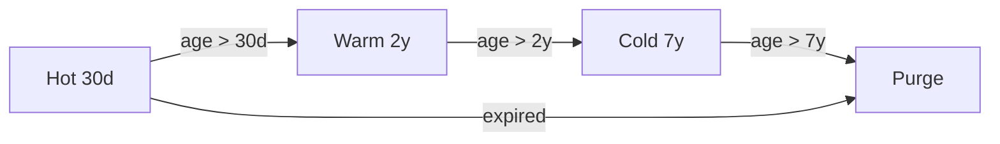

## Purpose

This policy establishes data retention and deletion requirements for all data stored in our PostgreSQL database and associated systems. It ensures we comply with GDPR, minimize storage costs, and reduce exposure in the event of a data breach. Without clear retention rules, stale data accumulates indefinitely, increasing both risk and infrastructure spend.

## Policy

All stored data must have an explicit retention period defined at the schema level. Data that exceeds its retention period must be automatically purged or anonymized within 30 days. The retention periods are:

- **Transaction records**: 7 years (regulatory requirement)
- **User session data**: 90 days
- **Application logs**: 30 days in hot storage, 1 year in cold storage
- **User account data**: Retained while account is active, deleted within 30 days of account closure
- **Analytics events**: 2 years, then aggregated and anonymized

Deletion jobs run nightly as PostgreSQL scheduled tasks. Each job logs the number of rows affected and any failures to the operations monitoring channel.

## Scope

This policy applies to all engineering teams that store data in the production PostgreSQL cluster (see ADR-001), associated backup systems, and any replicated data stores. It covers both structured relational data and semi-structured `jsonb` columns.

## Retention Overview

## Compliance

Compliance is measured through automated monthly audits. A scheduled job scans all tables for rows exceeding their defined retention period. Any table with more than 1000 over-retention rows triggers an alert to the responsible team. Quarterly compliance reports are shared with the security team.

## Roles

- **Data owner** (per-service): Defines retention periods for their service's tables and ensures deletion jobs exist.
- **Platform team**: Maintains the audit tooling and deletion framework.
- **Security team**: Reviews quarterly compliance reports and escalates violations.

## Enforcement

Teams that fail to define retention periods for new tables will have their migration PRs blocked by the CI schema checker. Repeated non-compliance (3+ quarterly violations) is escalated to engineering leadership.

## Review History

| Date | Reviewer | Changes |
|---|---|---|
| 2025-02-01 | @onni | Initial policy creation |
| 2025-04-15 | @bob | Added analytics retention period, clarified scope for jsonb columns |

