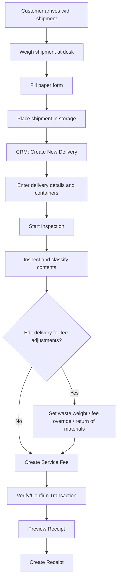

# Automated Service Fee Flow for Material Deposits

This document describes the automated service fee process for material deposits at the warehouse facility. It covers the full workflow from customer arrival to receipt generation, including fee calculation rules and special cases.

## Overview

The automated service fee process ensures that service fees for material deposits are calculated automatically, reducing manual work and errors. When a customer brings a shipment of goods for storage, the system handles weighing, inspection, fee calculation, transaction creation, and receipt generation.

## Inputs and Prerequisites

- Customer arrives with a shipment of goods for deposit
- Employee with CRM access (Admin/Core) is available for data entry
- Admin user has `acl:deliveries:create_service_fee` ACL permission (or is super admin)
- Organisation "Country of registration" field is correctly filled in Know Your Customer section (affects tax calculations)
- Delivery must use the new flow (containers attached) for automated service fee

## Outputs

- Delivery record created in CRM with shipment details and container information
- Inspection results recorded (content classification per container)
- Service fee transaction automatically calculated and created
- Verified transaction with receipt in English or local language

## Roles and Responsibilities

| Role | Responsibility | Owner |
|---|---|---|
| Front desk employee | Weigh shipment, fill paper form, place in storage | |
| CRM operator | Enter deposit and shipment data into CRM, create Delivery | |
| Inspector | Inspect and classify shipment contents per container | |
| Admin (with ACL) | Trigger service fee creation, verify transaction, generate receipt | |

## Process Flow

## Steps

1. **Customer Arrival** — Customer brings a shipment to the office for deposit
2. **Initial Handling** — Shipment is weighed at the desk, paper form is filled out by both customer and employee, shipment is placed in storage
3. **CRM Data Entry** — Navigate to `Customers → Deliveries → New Delivery` and fill in:
   - Customer type (Organisation/Identity)
   - Customer name
   - Location (default: auto-detected, editable)
   - Delivery date (auto-filled)
   - Courier service used (checkbox)
   - Shipment type: "Standard", "Fragile", or "Hazardous"
   - Origin declaration
   - Container seal numbers, gross weights and package weights
   - Deliverer name
4. **Shipment Inspection** — Use `Inspection: START` button in delivery view, add at least one container with inspection results. Waste weight is recorded per delivery (editable via `Edit Delivery` when status is `In inspection`)
5. **Service Fee Adjustments** — Before confirming inspection, optionally edit `waste weight`, `service fee override`, and `return of materials` fields (available when delivery is `In inspection`)
6. **Trigger Service Fee** — Use `Create service fee` button in delivery show view. Button is visible when delivery is `In Inspection` or `Confirmed`, and only for new-flow deliveries with containers
7. **Transaction Verification** — Service fee transaction must be verified/confirmed by an admin. Requires sufficient funds in the source account
8. **Receipt Generation** — Preview receipt, then use `Create receipt` and select language. Receipts can be recreated in another language

## Exceptions and Escalation

- **Fee override**: When fee override is used, no automatic receipt description is generated. Provide it by editing the transaction record (use edit button in **transaction show view**, NOT in delivery show view)
- **Old deliveries**: `Create service fee` button is not visible for deliveries from the old flow (without containers)
- **One-time fee creation**: Service fee can only be created once per delivery — the button disappears after use
- **Missing registration country**: If the Organisation's "Country of registration" field is empty, it is treated as "not domestic" which affects tax calculations
- **Only one shipment type per delivery**: Cannot mix standard, fragile, and hazardous in a single delivery

## Metrics

### Service Fee Calculation Rules

**Storage prices (EUR per kg):**

| Shipment Type | Price/kg | Minimum Fee |
|---|---|---|
| Standard | €0.25 | €50.00 |
| Fragile | €0.50 | €100.00 |
| Hazardous | €1.00 | €250.00 |

**Handling prices (EUR per kg):**

| Shipment Type | Price/kg |
|---|---|
| Standard | €0.10 |
| Fragile | €0.25 |
| Hazardous | €0.50 |

**Flat fees:**

| Fee | Amount |
|---|---|
| Return of materials | €50.00 |
| Courier service | €100.00 |

**Entity types for tax calculation:** Domestic business, Foreign business, Individual (not a business entity). Tax rates and formulas are maintained in the billing configuration.

## Revision History

| Date | Author | Changes |
|---|---|---|
| 2026-03-25 | | Initial version |
